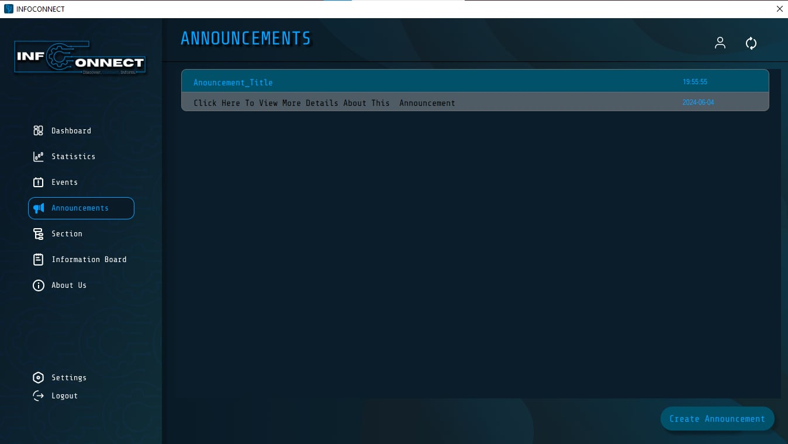
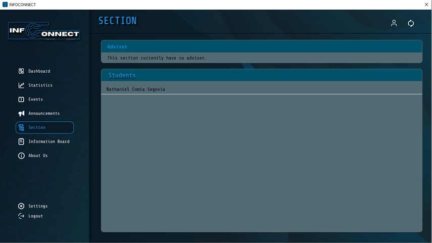

# InfoConnect

InfoConnect is a user-friendly Windows Form application designed to facilitate task management and communication between teachers and students. With features like announcements, events, profile management, and section details, InfoConnect aims to streamline administrative tasks and enhance collaboration within educational institutions.

## Table of Contents

- [Project Overview](#project-overview)
- [Key Features](#key-features)
- [Code Documentation](#code-documentation)
- [Testing](#testing)
- [User Guide](#user-guide)
- [Troubleshooting](#troubleshooting)
- [Frequently Asked Questions (FAQ)](#frequently-asked-questions-faq)
- [Tutorial/Instructional Video](#tutorialinstructional-video)
- [WinForms Screenshots](#winforms-screenshots)
- [Intermediate Programming Applied](#intermediate-programming-applied)
- [Conclusion](#conclusion)
- [Future Enhancements](#future-enhancements)
- [Acknowledgments](#acknowledgments)

## Project Overview

InfoConnect was started on April 23, 2024, and completed on June 3, 2024, by Nathaniel C. Segovia, Gio Andrew T. Briones, and Ry Y. Austria. The project aims to simplify task management and communication in educational settings by providing a centralized platform for announcements, events, and user profiles.

## Key Features

- **Announcement:** Teachers can create private announcements for each student of a particular section.
- **Events:** Teachers can create events, allowing access across sections and streamlining event coordination.
- **Section:** Updated teacher and student sections.
- **Profile:** Comprehensive user management validation for administrators.

## Code Documentation

- **GitHub Link:** [InfoConnect's GitHub Repository](https://github.com/nathsuki73/InfoConnect)
- **Coding Standards:** Followed consistent naming conventions, layout formatting, and modularized code structure.
- **Functions/Methods:** Documented key functions and methods for clarity and understanding.

## Testing

### Test Cases

- **Test Case 1:** Checking for empty fields in the sign-up form.
- **Test Case 2:** Verifying correct username/password combinations in the login form.
- **Test Case 3:** Ensuring proper handling of non-existent accounts.
- **Test Case 4:** Restricting student users from creating announcements and events.
- **Test Case 5:** Validating the requirement of an image when creating an event.

## User Guide

### User Interface

- **Front Page:** Sign-up and login buttons.
- **Login Interface:** Input fields for email and password.
- **Sign-up Interface:** Form for personal information input.
- **Dashboard Interface:** Previews of announcements, events, and real-time clock.
- **Announcements Interface:** List of viewable announcements.
- **Events Interface:** List of upcoming events.
- **Section Interface:** List of students for each section.
- **About Us Interface:** Developers' profile and program description.
- **Profile View/Edit Interface:** View and edit user profile details.

## Troubleshooting

- **Issue:** Announcements not refreshing after creation.
  - **Solution:** Navigate to a different section and return to the announcements.
- **Issue:** Description not creating a new line when it reaches a maximum characters.
  - **Solution:** Press the enter to create a newline in the textbox.

## Frequently Asked Questions (FAQ)

1. **Q:** What is the reason why the user interface seems to be glitching when switching into different phases of the program such as the dashboard, sections, announcements, etc.?
   - **A:** There can be many factors about the glitchy issue of our UI, one of these is the inefficient implementation of different high resolution images. In addition, our framework can also be one of the causes of the glitch issue. But overall, the program is working properly.
2. **Q:** Can students create and post announcements and events?
   - **A:** No, teachers or advisers are the only ones allowed to have the ability of posting different kinds of announcements and events.
3. **Q:** Is the program connected to any database?
   - **A:** Yes, InfoConnect is connected into a database. The developers managed to include a database to the program for the reason that it is an important component for the program in order to save the information of each and every user.

## Tutorial/Instructional Video

A comprehensive tutorial video has been created to explain how to use the app. This video includes step-by-step instructions, demonstrations of key features, and tips for maximizing the user experience.
The tutorial video is available on YouTube and can be accessed via the following link:

[Insert YouTube Video Link Here]

## WinForms Screenshots

*Front Page*

*Login Interface*

*Sign-up Interface*

*Dashboard Interface*

*Events Interface*

*Create Event Interface*

*Announcements Interface*

*Section Interface*

*About Us Interface*

*Profile View Interface*

*Profile Edit Interface*

## Intermediate Programming Applied

- Object-Oriented Programming (OOP) Principles
- Event Handling
- User Interface (UI) Management
- Database Connectivity
- Error Handling
- Security Considerations
- UI Thread Manipulation
- Resource Management
- Data Validation
- Modularization
- Component-Based UI Design

## Conclusion

This documentation for the Windows Forms application offers a comprehensive analysis of the program, covering everything from its technological complexities to its fundamentals. It outlines the developers, program name, creation date, and core functionality. Diving deeper, the document explores intermediate programming concepts used in development, testing procedures to ensure smooth operation, and troubleshooting methods for handling issues. Additionally, it details the specific algorithms and methods that power the application. To further enhance understanding, the documentation incorporates screenshots with clear explanations, visually showcasing key features. This comprehensive approach ensures the document serves as a valuable resource for users of all levels. Readers will acquire a clear comprehension of the program's operation, its intended objectives, and the potential for future enhancements.

## Future Enhancements

The application developers intend to optimize the program in order to reduce glitches and improve its overall flow in future updates and revisions. The developers also intend to develop the various parts of the application, including the settings, information board, and statistics. With everything functioning and interactive, the user may experience the software seamlessly from start to finish.

## Acknowledgments

**External resources:**
- Guna Framework
- MySQL
- XAMPP

**Libraries:** N/A
**Contributors:** N/A
